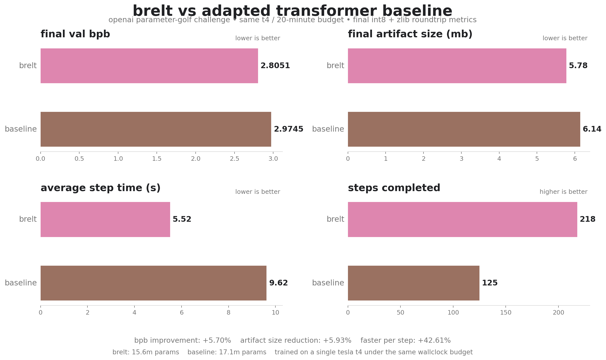

# brelt

**b**yte-level **re**current **l**atent **t**ransformer

brelt is a compression-first language modeling architecture.

> a model should not have to think over the full byte or token sequence at one flat resolution all the time

instead, brelt tries to:

-> read raw bytes
-> compress local spans into patch latents
-> run recurrent global mixing over a much shorter internal sequence
-> decode back to byte predictions
-> stay robust under aggressive quantization and tiny checkpoint budgets

this repo currently contains two main things:

- `train_gpt.py` - the actual brelt training script
- `train_gpt.adpt` - the adapted baseline used for the side-by-side comparison

---

## current result



under the same t4 / 20-minute benchmark budget:

| model | val bpb | total size | params | steps |
| --- | ---: | ---: | ---: | ---: |
| adapted baseline | `2.97452923` | `6,142,670` bytes | `17,059,912` | `125` |
| brelt | `2.80505946` | `5,778,351` bytes | `15,615,932` | `218` |

**relative bpb improvement of brelt vs baseline: `+5.70%`**

the final compressed artifact stayed strong after roundtrip:

- `final_fp_raw val_bpb: 2.8020`
- `final_int8_zlib_roundtrip val_bpb: 2.8051`

so the model stays both **small** and **competitive**

---

## what brelt is trying to do

almmost all lms still operate on a flat visible sequence:

-> tokens in
-> full sequence processing
-> tokens out

brelt treats the byte stream as the minimal causal interface, but not as the final internal unit of thought.
the model tries to learn a shorter internal sequence made of latent patches and super-latents, then do most of the expensive work there,
so that compression happens in the internal representation rather than only at the output layer.

in very rough form:

```text
bytes
  -> local byte encoder
  -> patch segmentation
  -> patch commit into span latents
  -> recurrent global latent mixing
  -> bridge back to local space
  -> byte logits
```

that makes brelt a lot closer to a **causal neural compressor** than to transformer

---

## the thesis, kurzgesagt

brelt is based on the idea that language modeling should be treated as a constrained rate-distortion problem.
if a latent representation is going to exist, it should **pay for itself**: it should reduce byte prediction cost more than it costs to model the latent itself.
that leads to a model where segmentation, latent formation, recurrent refinement, and export-time quantization are all part of the same problem instead of separate engineering phases

---

## the mathematical framing

we care about bits per byte directly:

```math
\mathrm{bpb}(x) = -\frac{1}{T} \sum_{t=1}^{T} \log_2 p(x_t \mid x_{1:t-1})
```

instead of assuming the model must reason over the full byte sequence at uniform resolution, brelt introduces latent spans:

```math
x = (x_1, \ldots, x_T), \quad s_1, s_2, \ldots, s_K, \quad K \ll T
```

and tries to approximate a factorization like:

```math
p(x) \approx \prod_{k=1}^{K} p(z_k \mid z_{1:k-1})\, p(x_{s_k} \mid z_k, x_{1:s_k-1})
```

where:

- $z_k$ is the latent for span $s_k$
- $p(z_k \mid z_{1:k-1})$ is the causal prior over latents
- $p(x_{s_k} \mid z_k, x_{1:s_k-1})$ is the local byte decoder

training is then shaped like a rate-distortion objective with stability terms:

```math
\mathcal{L} = \mathcal{L}_{\mathrm{dist}} + \lambda \mathcal{L}_{\mathrm{rate}} + \gamma \mathcal{L}_{\mathrm{stab}}
```

where:

- $\mathcal{L}_{\mathrm{dist}}$ pushes byte prediction quality
- $\mathcal{L}_{\mathrm{rate}}$ forces the latent stream to remain compressible
- $\mathcal{L}_{\mathrm{stab}}$ keeps the recurrent latent dynamics trainable and quantization-safe

in other words, the latent should be economically justified

---

## the sight beyond the benchmark

the immediate win is a parameter-golf style result, but that is not the whole point.
if the architecture keeps scaling, brelt points toward models that can potentially handle very long contexts more naturally than flat token-only models and operate over a shorter internal sequence than the visible one.

in other words, the project is about whether a model can compress while it thinks.

---

## the working bits

the current winning run proved a few important things:

-> recurrent global latent mixing can work under a strict t4 budget
-> the architecture can beat the adapted baseline fairly
-> the quantized export can make the final artifact up to 10x smaller without major losses

there are still a lot of rough edges, of course, but brelt can now stand on its own.

---

## the unfinished bits

the current model wins, but it is not the full thesis realized yet

the main unfinished parts are:

- truly learned segmentation that is in charge instead of mostly stabilized by safety rails
- stronger patch commit / segment codec behavior
- a latent stream that pays more meaningful rent instead of becoming too easy for the prior
- a more fully realized rate-distortion controller
- more scaling work under larger compute budgets

this is a winning and very promising brelt, not a finished brelt. there is still headroom for improvements that should be tested under more powerful compute.

---

## roadmap

make segmentation truly learned without reintroducing patch explosion
make span commit stronger and more causal 
force the latent to carry more meaningful burden 
make the global recurrent core stronger without losing throughput 
keep pushing quantization as a co-designed part of the architecture 

the next goal is to won by an absurd margin!

---

## papers and ideas behind brelt

brelt stands by giant's shoulders, being a synthesis of several lines of thought

- **byte latent transformer** — dynamic patching over raw bytes  
  https://arxiv.org/abs/2412.09871

- **universal transformer** — shared recurrent depth  
  https://arxiv.org/abs/1807.03819

- **turboquant / qjl / polarquant context** — geometry-aware quantization as a first-class systems concern  
  https://research.google/blog/turboquant-redefining-ai-efficiency-with-extreme-compression/

more generally, brelt sits at the intersection of byte-level modeling, hierarchical latent modeling, rate-distortion / mdl style thinking, recurrent shared-depth architectures, quantization-aware systems design, and tons of other amazing research lines developed over the years.

---

## repo layout

```text
train_gpt.py       # main brelt training script
train_gpt.adpt     # adapted baseline for comparison
demo/              # future demo / inference scaffolding
```

---


## status

this repo is still evolving, and there are still many ideas left to test and validate
